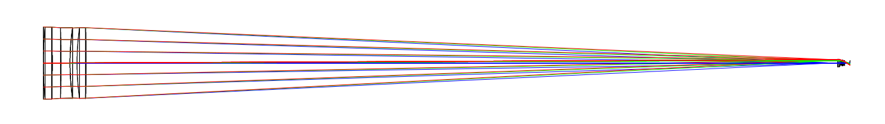
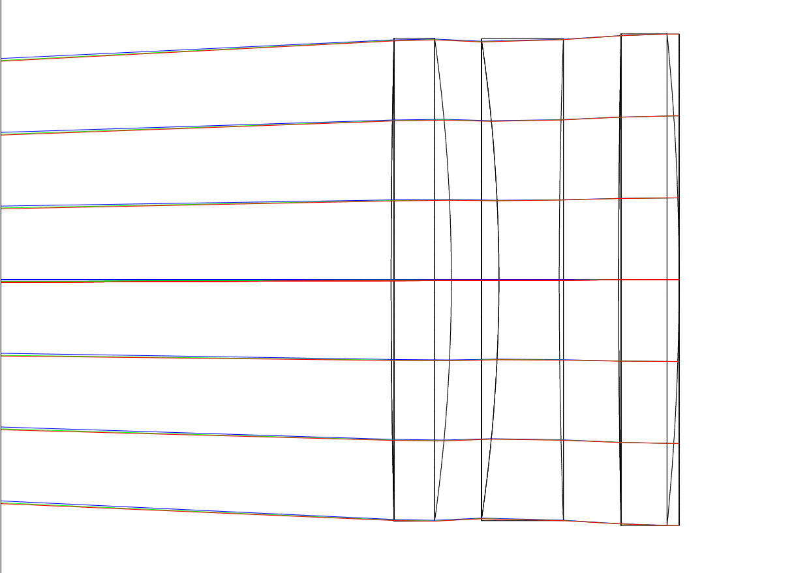
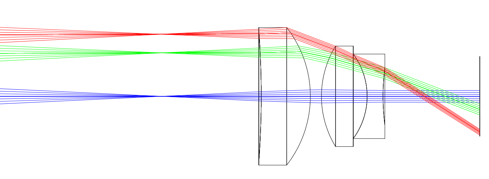
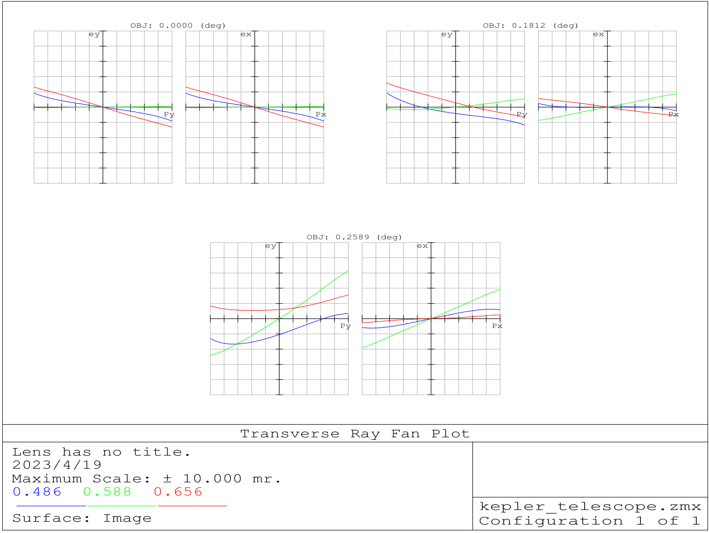
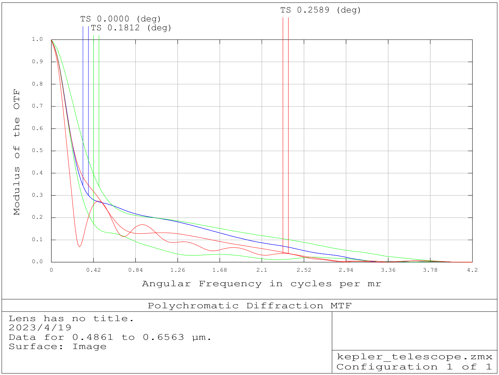
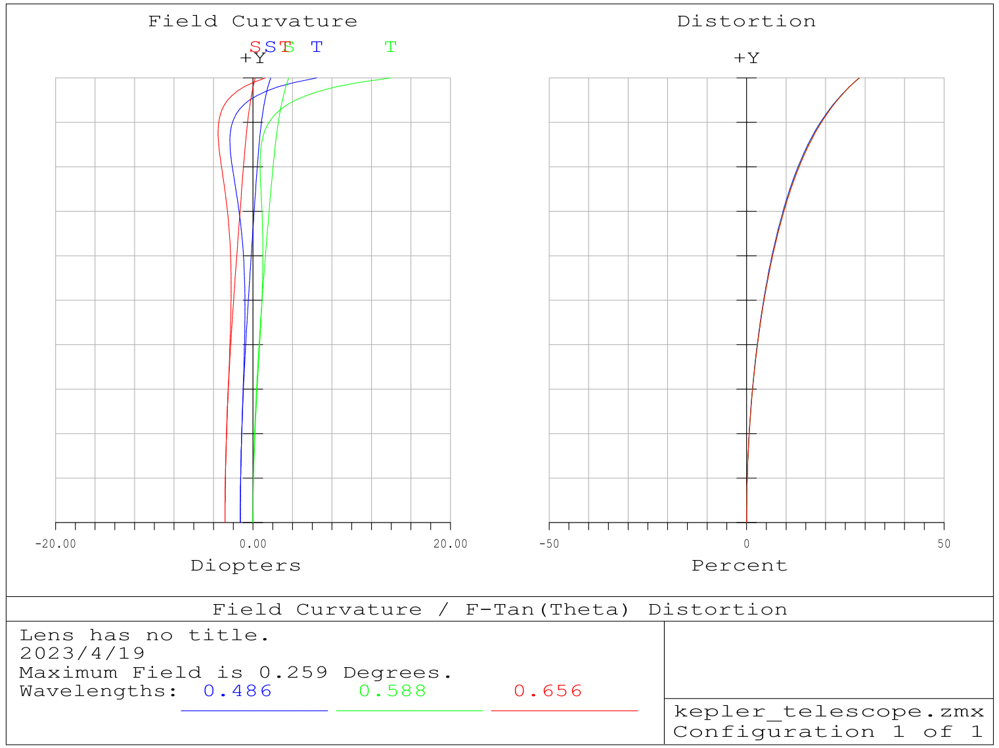
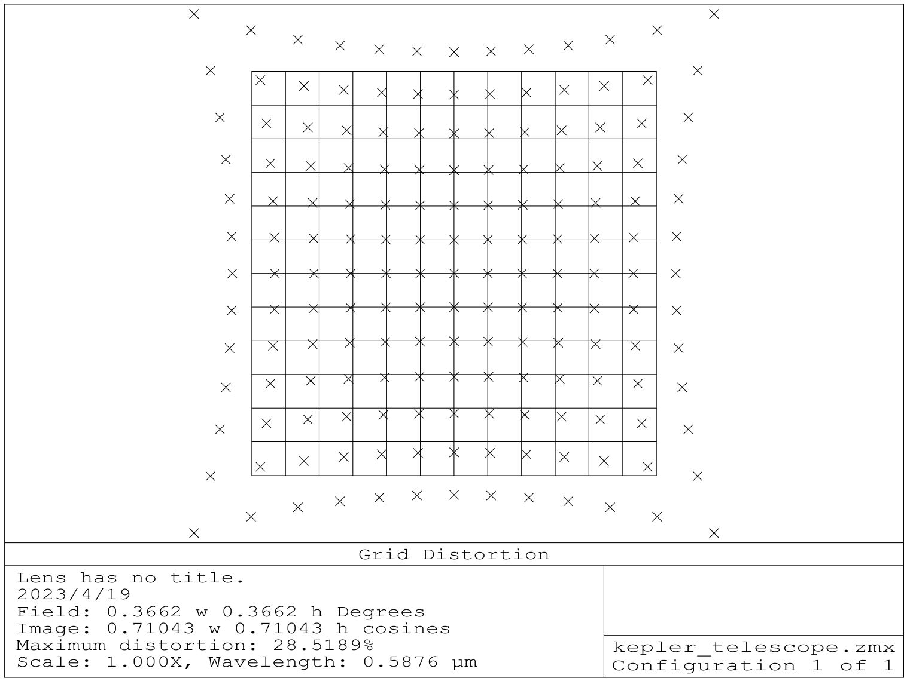
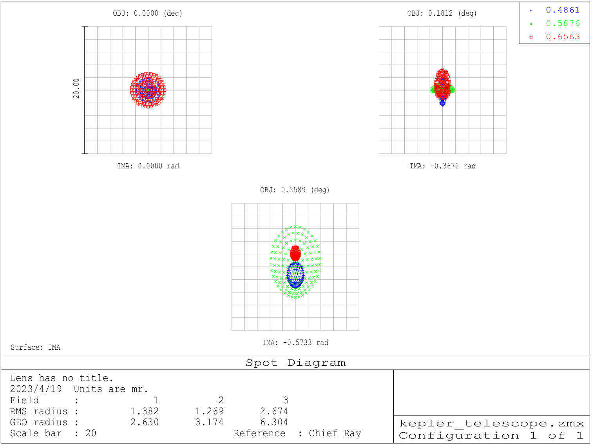
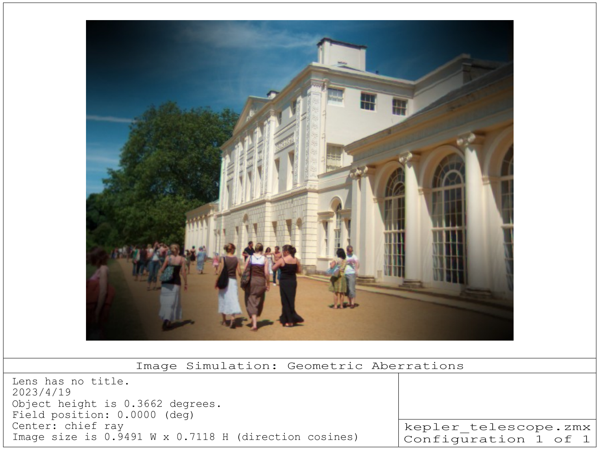

# A Simple Keplerian Telescope Design

This is a simple optical design project based on ZEMAX 2013, it is a Keplerian telescope to be specific.

In this repo the zemax design files of initial structure, optimized structure and the final structure for the:

1. objective lens;
2. eyepiece lens;
3. assemble of objective lens and eyepiece lens

are provided.

The paraxial working F/# of this telescope system is 10000, so theoretically speaking, it is possible to observe the moon with this system.

## System Analysis

### Layout

Overall Layout

Objective Lens Layout

Eyepiece Lens Layout

### Ray-Fan Plot

### MTF

### Field Curvature

### Grid Distortion

### Spot Diagram

### Image Simulation (Rotated)

## General Lens Data

|key|value|
|-|-|
|Surfaces| 13|
Stop | 1
System Aperture | Entrance Pupil Diameter = 224
Afocal Image Space | On
Glass Catalogs | SCHOTT HOYA CDGM
Ray Aiming | Off
Apodization | Uniform, factor = 0.00000E+000
Temperature (C) | 2.00000E+001F
Pressure (ATM) | 1.00000E+000
Adjust Index Data To Environment | Off
Effective Focal Length | -9.999871e+009 (in air at system temperature and pressure)
Effective Focal Length | -9.999871e+009 (in image space)
Back Focal Length | 8.995486e+007
Total Track | 2479.493
Image Space F/# | 4.464228e+007
Paraxial Working F/# | 10000
Working F/# | 8811.271
Image Space NA | 1.490116e-008
Object Space NA | 1.12e-008
Stop Radius | 112
Paraxial Image Height | 4.518888e+007
Paraxial Magnification | 0
Entrance Pupil Diameter | 224
Entrance Pupil Position | 0
Exit Pupil Diameter | 2.015014
Exit Pupil Diameter-X | 2.015014
Exit Pupil Diameter-Y | 2.015014
Exit Pupil Position | -3.774128
Field Type | Angle in degrees
Maximum Radial Field | 0.2589147
Primary Wavelength | 0.5875618 µm
Lens Units | Millimeters
Angular Magnification | -111.1655

Fields: 3

Field Type: Angle in degrees

|\#|X-Value| Y-Value| Weight|
|-|-|-|-|
|1| 0.000000| 0.000000| 1.000000|
|2 |0.000000 |0.181240 |1.000000|
|3 |0.000000 |0.258915 |1.000000|

Wavelengths : 3

Units: µm

|\#| Value| Weight|
|-|-|-
1 |0.486133 |1.000000|
2 |0.587562| 1.000000|
3 |0.656273| 1.000000|

## License

GPL
